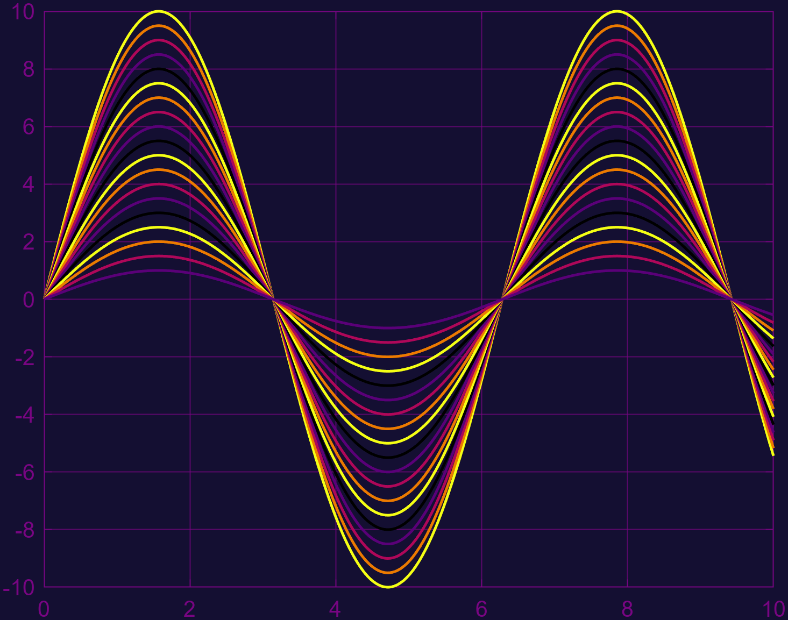
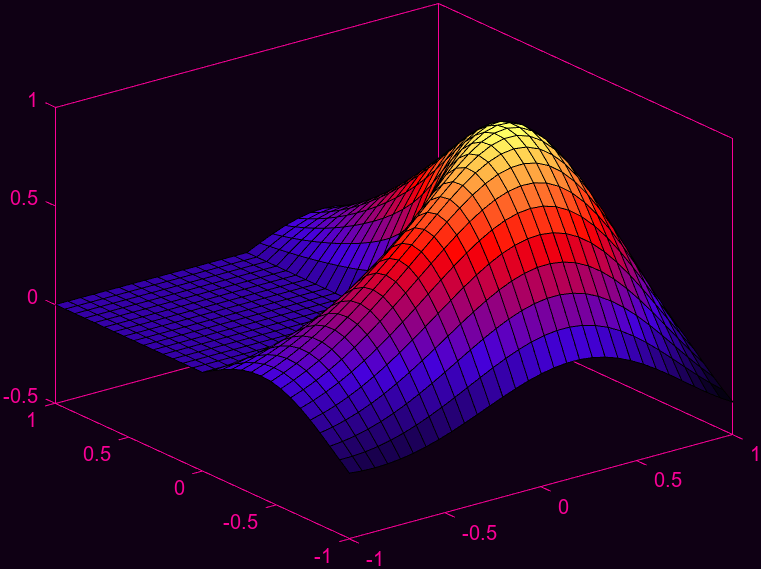

# MATLAB colorthemes
  

"MATLAB colorthemes" is a library that contains various different colorthemes designed to be used together with the MATLAB-app designer and MATLAB plots.

  

Without colortheme:

```matlab:Code
my_plot = plot(0:0.01:10, (1:10)'*sin(0:0.01:10))
```


# Different colorthemes:
  

fireflies:

```matlab:Code
my_plot = plot(0:0.01:10, (1:10)'*sin(0:0.01:10))
fireflies()
```


borealis:

```matlab:Code
my_plot = plot(0:0.01:10, (1:10)'*sin(0:0.01:10))
borealis()
```


sangbok:

```matlab:Code
my_plot = plot(0:0.01:10, (1:10)'*sin(0:0.01:10))
sangbok()
```

  


  
  
# Changing the amount of colors before it repeats:

```matlab:Code
my_plot = plot(0:0.01:10, (1:40)'*sin(0:0.01:10))
fireflies("ColorSamples", 10)
```

  



  
# Different plot-types:

```matlab:Code
my_plot = membrane()
fireflies();
```

  



# Used together with UI-figures and MATLAB-appdesigner:

```matlab:Code
my_app = rear_axel_dashboard;

fireflies();

```


  
  
# Plotting multiple plots with different color-themes:

```matlab:Code
myplot1 = subplot(1,2,1)
plot(0:0.1:10, sin(0:0.1:10));
myplot2 = subplot(1,2,2)
plot(0:0.1:10, cos(0:0.1:10));

borealis( "Figure", myplot2)
fireflies("Figure", myplot1)
```

  
  


  
  
# Creating your own color-theme:
  

```matlab:Code
function my_colortheme(varargin)

colortheme_process_inputs_subroutine

color1 = [255 255 100]/255;
color2 = [255 0   0  ]/255;
color3 = [70  0   220]/255;
color4 = [0   0   0  ]/255;

BACKGROUND_COLOR_1 = [15  0 20]/255;
BACKGROUND_COLOR_2 = [15  0 20]/255;
AXES_COLOR         = [250 0 150]/255;

NEW_COLORORDER     = create_colormap(color1, color2, color3, color4, number_of_hues);
NEW_COLORMAP       = create_colormap(color4, color3, color2, color1, 256);

colortheme_assign_colors_subroutine

end
```
